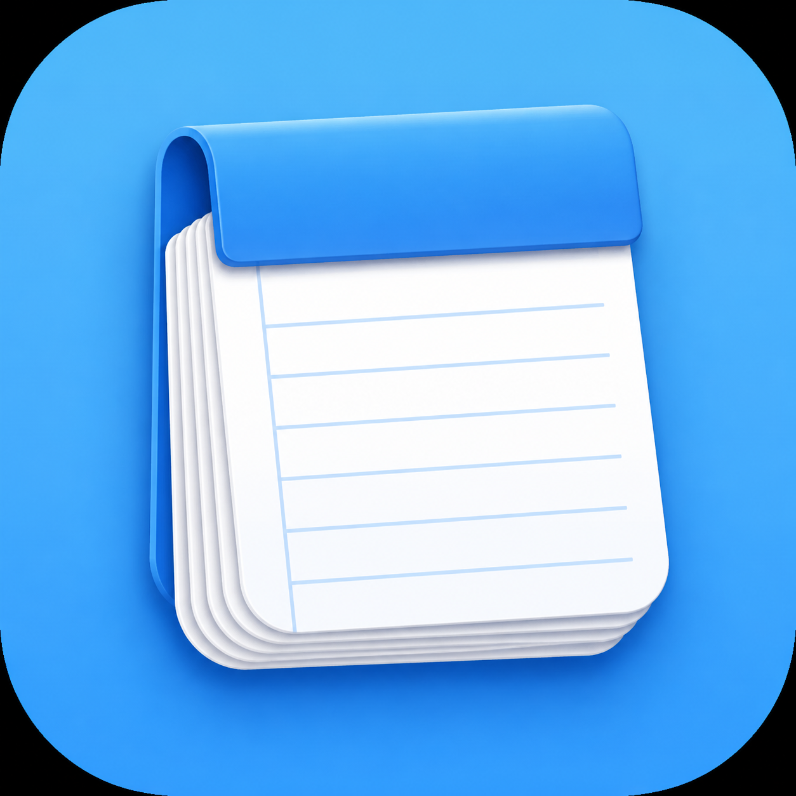

# myPad

myPad is a small native macOS scratchpad app for quick notes.

The first release focuses on the basics: instant writing, multiple tabs,
automatic session restore, font controls, word wrap, and zoom.



## Features

- Fast native macOS app built with SwiftUI and AppKit.
- Multiple note tabs.
- Automatic session restore after quitting and reopening the app.
- Font family and font size controls.
- Word wrap toggle.
- Zoom in, zoom out, and reset zoom.
- Lightweight local-only storage.
- Blue macOS app icon.

## Requirements

- macOS 14 or later.
- Swift Package Manager.
- Xcode Command Line Tools or Xcode.

## Build And Run

From the project folder:

```bash
/bin/bash ./script/build_and_run.sh
```

The script builds the Swift package, creates a local app bundle at
`dist/myPad.app`, ad-hoc signs it, and opens the app.

## Install To Applications

From the project folder:

```bash
/bin/bash ./script/install_app.sh
```

The installer builds the app and copies it to `/Applications/myPad.app` when the
folder is writable. If `/Applications` is not writable, it falls back to
`~/Applications/myPad.app`.

After installation, search for `myPad` in Spotlight.

## Install With Homebrew

After the Homebrew tap is available, install with:

```bash
brew tap abhurisiwarak-byte/tap
brew install --cask mypad
```

To upgrade later:

```bash
brew update
brew upgrade --cask mypad
```

## Local Data

Unsaved scratch notes are stored locally in the user's Application Support
folder:

```text
~/Library/Application Support/myPad/session.json
```

The app does not sync data, send telemetry, or use a server.

## Development Notes

The app is intentionally simple:

- `Sources/myPad/App` contains app startup and macOS lifecycle glue.
- `Sources/myPad/Stores` contains tab/session persistence.
- `Sources/myPad/Views` contains SwiftUI views and the AppKit text editor bridge.
- `Resources` contains the generated app icon source and `.icns` file.
- `script` contains build and install helpers.

Build outputs such as `.build`, `build`, and `dist` are ignored by git.

## Roadmap Ideas

- Open and save `.txt` files.
- Markdown preview/source toggle.
- Find and replace.
- Tab renaming.
- Export or import session notes.
- Signed and notarized release builds.

## License

MIT License.
